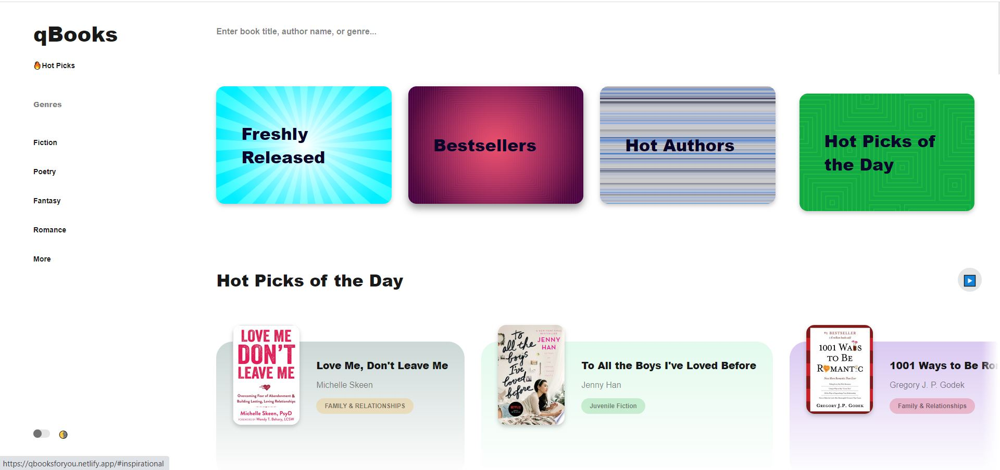
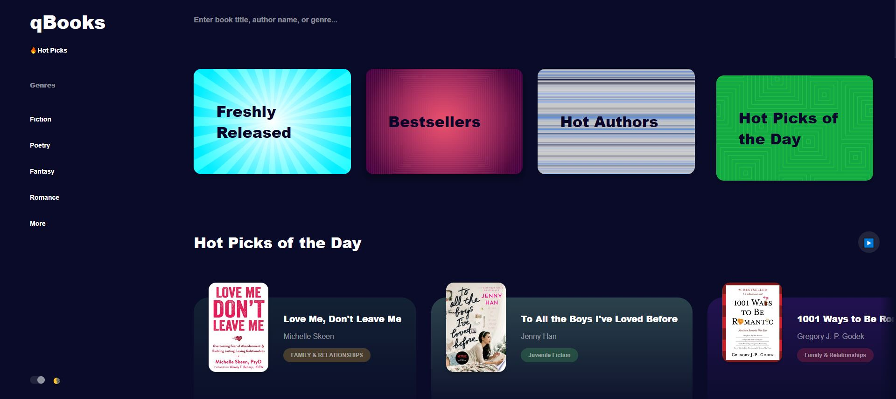

# Project Title

A web app to find books on Google Books

## Description

The web app comes with a search feature that allows you to search books on Google Books in real time. Search can be performed using book titles, author names, genre. The web app also includes a day and night mode feature.

## Screenshots

## Link

https://qbooksforyou.netlify.app/
[Read about qBooks](https://www.linkedin.com/pulse/qbooks-find-books-real-time-davies-ajayi/)

## Getting Started

* Find books in real-time with search feature
* Use dashboard to access new books, bestsellers, best authors, and hot picks of the day
* Explore a long list of genre
* toggle day and night mode

## Author
Davies Ajayi
Find me on [LinkedIn](https://www.linkedin.com/in/davies-ajayi-6133b616b/?originalSubdomain=de)

## Version History

* 1.00
